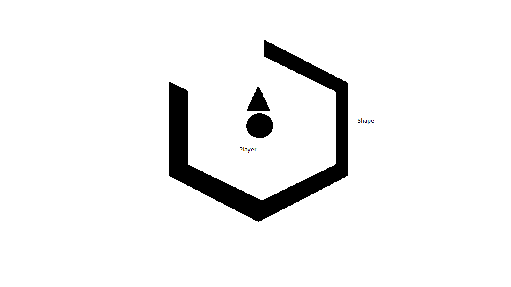

## JS Project Proposal: Hexagonal

### Background

Hexagonal is a game inspired by Super Hexagon, where the player rotates a small object in the middle of the screen and dodges randomized rotating shapes that enclose the player. The player loses once the shape makes contact with the rotating shape.

### Functionality & MVP  

Game Functionality:

- [ ] Start and Pause on space, movement with left and right arrow keys
- [ ] Shapes randomized and rotating clock or counterclockwise
- [ ] Game ends once player fails dodge

In addition, this project will include:

- [ ] Controls, timer, score
- [ ] A production README

### Wireframes

This app will consist of a single screen with a start button. After start, the player will be able to control a small object that rotates around a larger center. A timer on bottom left will keep track of current time, with a best time on bottom right.

### Architecture and Technologies

This project will be implemented with the following technologies:

- Vanilla JavaScript and `jQuery`
- `Easel.js` with `HTML5 Canvas` for DOM manipulation and rendering
- Webpack to bundle and serve up the various scripts.

In addition to the webpack entry file, there will be three scripts involved in this project:

`view.js`: this script will handle the logic for creating and updating the necessary `Easel.js` elements and rendering them to the DOM.

`game.js`: this script will handle the logic behind the scenes. There will be a `player` object that will have an angle and rotate around the center of the screen. The game will generate `shapes` that rotate randomly, detect collisions, and keep track of score.

`shape.js`: this script will have the `Shape` objects.  Each `Shape` will be a hexagon that is missing some number of sides and have a shrinking `radius` and `rotate` direction.

### Implementation Timeline

**Day 1**: Setup all necessary Node modules, including getting webpack up and running and `Easel.js` installed.  Create `webpack.config.js` as well as `package.json`.  Write a basic entry file and the bare bones of all 3 scripts outlined above.  Learn the basics of `Easel.js`.  Goals for the day:

- Get a green bundle with `webpack`
- Learn enough `Easel.js` to render an object to the `Canvas` element

**Day 2**: Dedicate this day to learning the `Easel.js` API. First, build out the `player` object to connect to the `View` object. Then, use `view.js` to create and render the `player` and a `shape`. Build in the ability to rotate the `player` around. Goals for the day:

- Complete the `shape.js` module (constructor, update functions)
- Render `player` to the `Canvas` using `Easel.js`
- Rotate `player` around using left and right arrow keys

**Day 3**: Create the logic backend. Detect collision between rotating shapes and player object, and shrink radius of `shape`s after a certain time period. Keep track of time. Goals for the day:

- Get `shape`s to rotate and shrink per time period
- Game stops when `player` collides with `shape`

**Day 4**: Install player start and restart buttons and best time score. Style the frontend, making it polished and professional.  Goals for the day:

- Create controls stop, start, reset
- Have a styled `Canvas`, nice looking controls and title

### Bonus features

- [ ] Add pulsing `shapes`
- [ ] `player` also rotates independently to increase difficulty
- [ ] Add colors/general visual improvements
