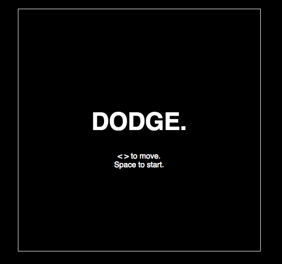
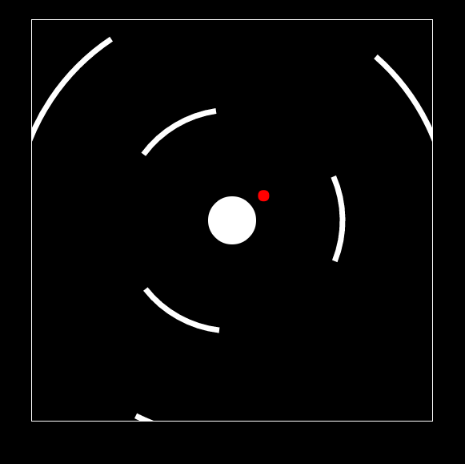

## Hexagonal

### Background

Super Circles is a game inspired by Super Hexagon.

[Play it here!](https://amory-peng.github.io/supercircles)

### Overview

Game Functionality:

Super circles is built with Javascript using the HTML5 canvas. The player (red ball) must dodge rotating shapes generated at increasing frequency.





### Design
Each `game` instance handles a `player` and generates `shapes` at gradually shortening intervals. Each frame shrinks the `shapes` in the game, checks for collision, and calls `requestAnimationFrame` to simulate animation.

### Collision Checking
Once a `shape` shrinks down to a radius near the player, the angles of rotation of the `shape` and the `player` are compared. These angles are kept within -360 to 360 degrees to account for full rotation and still detect overlap.

```javascript
handleCollision(other) {
  let collision = false;
  this.startAngles.forEach( startAngle => {
    //check if shape radius within player radius
    if (other.radius - BALL_RADIUS <= this.radius &&
      other.radius + BALL_RADIUS >= this.radius) {
      let end = startAngle + this.arcLength;
      let start = startAngle;
      if (start >= 360 || end >= 360) {
        end -= 360;
        start -= 360;
      }
      //check for angle overlap, account for angle rotation
      if (other.angle > start && other.angle < end ||
        other.angle - 360 > start && other.angle - 360 < end ||
        other.angle + 360 > start && other.angle + 360 < end) {
        collision = true;
      }
    }
  });
  return collision;
}
```

### Difficulty
A `timer` variable keeps track of the number of frames that have occurred. As the timer increments, the rate of `shape` generations increases, capping at 2 `shapes` generated per second.

```javascript
if (this.timer === this.generateRate) {
  this.game.generateShape();
  if (this.difficulty + 30 < GENERATE_SHAPE_FRAME) {
    this.difficulty++;
  }
  this.generateRate += GENERATE_SHAPE_FRAME - this.difficulty;
}
this.game.tick();
```

A `vars` file keeps track of the variables and allows for easy manipulation of shape radius, rotation speed, and rate of generation.

### Future features
Since the `shape` generation occurs at a set rate, there is potential for music with a matching beat to be added. More shapes could increase gameplay variety as well.
